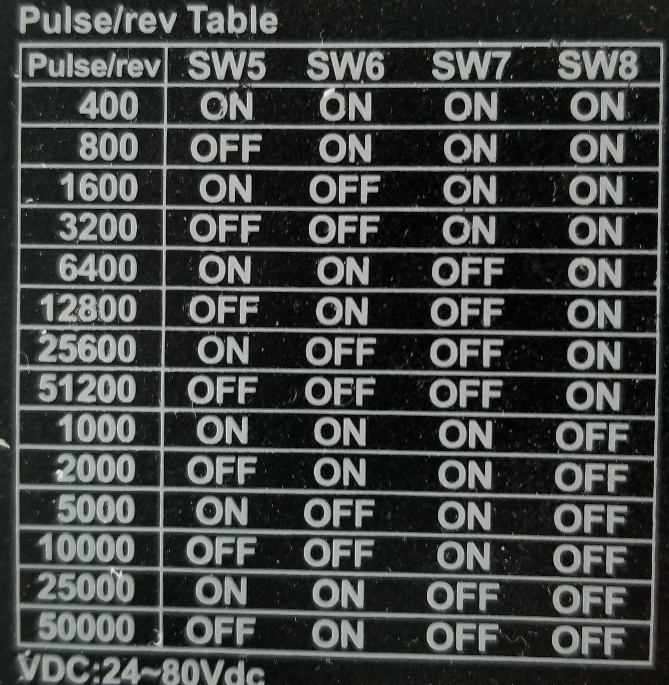

# BFP

The ETH Zürich's Student Project House's "Bulky but Fabulous Printer" - (BFP)

## TOC

1. [Introduction](#introduction)
1. [Features](#features)
1. [Bill Of materials](#bill-of-materials)
1. [Print settings](#print-settings)
1. [Wiring](#wiring)
   - [Print Head wiring](#print-head-wiring)
1. [Future plans](#hopefully-coming-sometime-)
1. [Credit and Thanks](#credit-and-thanks)

1. [Printed parts](#printed-parts)
<!-- 1. [Assembly guide](#assembly-guide) -->

## Introduction

The ETH Zürich's Student Project House's "Bulky but Fabulous Printer" - (BFP) is a large H-bot / CoreXY style FDM printer with a build volume of 1㎥ ( 0.8 × 1.2 × 1.1 ).
It was built by members of the [Student Project House (SPH)](https://sph.ethz.ch/big3d/) and is intended to be used by any user of the SPH (after a machine introduction).
<!-- It is currently a FDM printer, although are ideas for extending the print end to accommodate other materials to take advantage of the large print volume. -->

## Features

 - Large build volume 1㎥ ( 0.8 × 1.2 × 1.1 ),
 - Capable of large volumetric flow rates,
 - Can print much stronger (and larger) parts,
 - Can print wide range of materials, e.g. fibre reinforced filaments, polycarbonate (PLA to PEEK) - PTE default,
 - Removable print platform,
 - Auto mesh bed leveling,
 - Print heads can be swapped,
 - Cura slicer

## Bill Of materials

Please see here the [BOM](https://docs.google.com/spreadsheets/d/1Y9vpOhxNVT4gwxp1NMAN9-1OQtclcSS-GbRdNIxf8Fs/edit?usp=sharing).
Some parts, such as the aluminium brackets,  mountings and X-axis, were machined.
The some profiles were also cut down to size.

The 'interesting' components are listed below:

 - [Duet3D ethernet controller board](https://www.duet3d.com/DuetEthernet) with [breakout board](https://www.duet3d.com/Expansion_Breakout),
 - [80W E3D Volcano hot end](https://e3d-online.com/collections/hotends/products/supervolcano-upgrade-kit)
 - IR differential height sensor
 - Optical endstops
 - Stepper motors,
 - [Stepper Controllers](http://www.americanmotiontech.com/upload/Manuals/DM860m.pdf),
 - HiWin linear motion, rails and ball-screw,
 - aluminium Extrusions,
 - 2 × 24V 6.5A Power supply
 - 1 × 24V 13A Power supply
 - 12 × Build-tak (300×300)
 - 220V 500W heater pads, switched with a SSR

## Print settings

Finding the right print settings is a time consuming task.
Use the existing presets.

<!-- ## Assembly guide -->
<!--  -->
<!-- Some rough steps and guidelines on how to build your own: -->
<!--  -->
<!--  1. Assemble the frame, use the CAD drawings as a reference -->
<!--  2. Ensure the Z Stepper motors are connected -->
<!--  3. Wiring Cabinet. -->
<!--  -->
<!-- ## Printed parts -->
<!--  -->
<!-- Many parts were printed, see here for a list including the STL / CAD files. -->

## Maintenance

Some general information:

 > ⚠ **Electrical Hazard!** Large capacitors are used to smooth the power for the motors, this means significant power could be stored in the electrical cabinet even though it is powered down, **do not** mess with the electronics if you don't know what you're doing,
 > ⚠  **Never Disconnect the motors while the printer is on.** The motors are connected through XLR plugs.

 > Every now and then the kinematics should be cleaned and oiled.

### Disassembling the Print-head

#### Print Head wiring

 | <!-- --> | <!-- --> |
--- | ---
         | 
 | 

Note for the fans that the Extruder fan should be always connected to the always on connector.

## Future plans

Hopefully coming sometime, maybe even soon,

 - Tool Changer

 The initial work has been done for this. The mounts are machined. It's a matter of remounting the hotend and making the changing part of the tool changer.

#### Future ambitions:

 -  Silicon Printing
    - For printing moulds

## Do Not Touch Settings

  
These settings should **not** need to be changed, but are supplied here for reference.

### Adding a material

It is recommended to tune the PID values for the hotend (and bed).
Use the [autotune method](https://duet3d.dozuki.com/Guide/Ender+3+Pro+and+Duet+Maestro+Guide+Part+4:+Calibration/40#s161) described `M303 H1 SXXX` where XXX is the temperature to tune for. Then use `M307` to output the values.
Then in the appropriate filament configuration file, `filament/<TYPE>/config.g`, add `M307 H1 AXXX.X CXXX.X DX.X S1.00 V24.0 B0` as per [the duet instructions](https://duet3d.dozuki.com/Wiki/Filaments).

### Microstepping and Motor Controller settings

The micro-stepping and motor-controller current settings are controlled by DIP switches on the controllers, these differ for the Z and XY motors.
A corresponding micro-stepping setting much also be changed with a corresponding `M-Code` for the controller.

The controllers settings are encoded in GCode, a copy of the file from 2020-09-05 is [here](controller/sys/config.g)

The HTTP server is configured for `192.168.1.3`.

GCode Reference: [GCode Reference](https://duet3d.dozuki.com/Wiki/Gcode)

## Microstepping and current settings

All steppers use the same micro-stepping setting of 3200 pulse/rev = ×16 μStepping (motors are 200 steps/rev = 1.8° per step), (`SW5, SW6 OFF` `SW7, SW8 ON`)
The X-Y stepper controllers should have their current settings of 2.8A peak, 2.0A RMS (`SW1, SW2, SW3; ON, SW4 OFF`), this is done to reduce vibrations.

 XY Motor Controllers.

The Z stepper controller use 7.8A peak, 5.6A RMS (`SW1, SW2, SW3, SW4, OFF`).
Z Motor Controller: 

  

### Duet 2 Ethernet settings

[Duet3D documentation](https://duet3d.dozuki.com/Wiki/Step_by_step_guide)
Important things to note are:

 - For wiring and connections, see the Duet connections [here](images/duetConnections.png).
 - External stepper-controllers are used,
 - Power for the Heated bed is done through an SSR,
 - On `192.168.1.3`, see '`BFP`' host entry in `/etc/hosts`

## Credit and Thanks

This project would have not been possible without the generous support of our sponsors:

 - [HiWin](https://www.hiwin.com/index.html "HiWin") - for linear movement components, to ensure BFP is *Fast*, and *Beautiful*,
 - [Duet3D](https://www.duet3d.com/ "Duet3D") - for the electronics that control the printer is *Fast*,
 - [Item](https://www.item24.ch/en/ "Item24") - for the aluminium profiles that gives the printer so much *Beauty*, (and *Bulkiness*).

Of course credit also must go to the Student Project House, for funding and providing the tools and space for our *Big*, *Fantastic* Printer.

Also thanks to those that helped in the design, construction, and assembly of the printer:

 - [Andrea Perissinitto](https://github.com/hiiragii)  - Project Lead
 - [Oliver Harley](https://github.com/ixil),
 - Killian Hanke,
 - Max Schäfer
