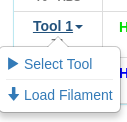
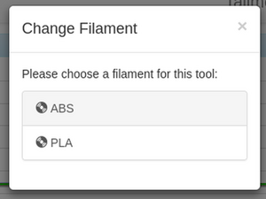
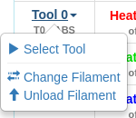
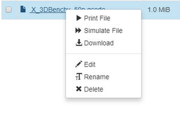

See [https://duet3d.dozuki.com/Wiki/Duet_Web_Control_Manual](https://duet3d.dozuki.com/Wiki/Duet_Web_Control_Manual) for instructions on the duet usage

Some images that might be useful are in [the folder here](./images/)

## Filament loading/Unloading
Loading: 

Unloading: 

## Simulating a print

https://duet3d.dozuki.com/Wiki/Duet_Web_Control_v2_and_v3_%28DWC%29_Manual#Section_Simulating_a_print

### Images:

